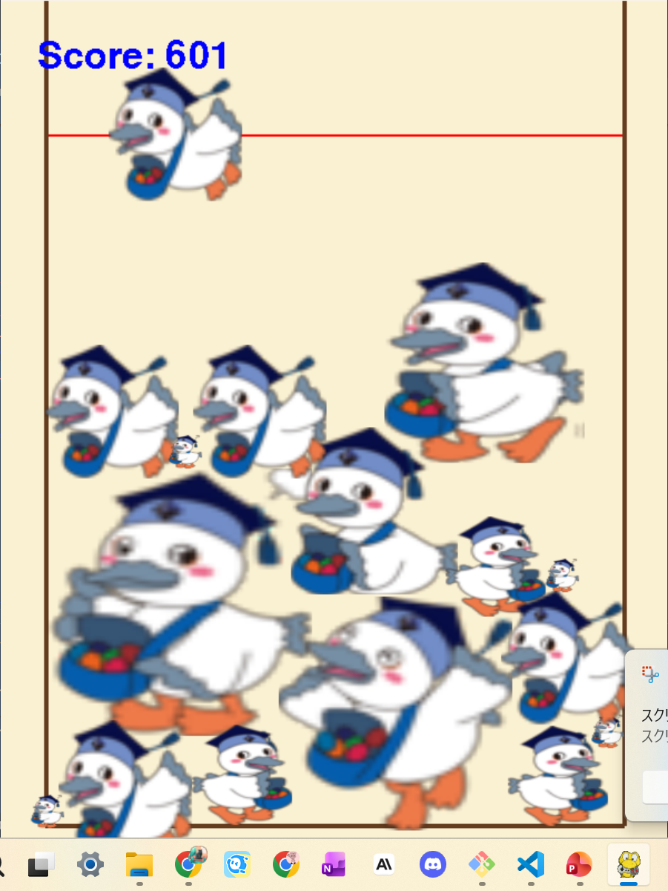
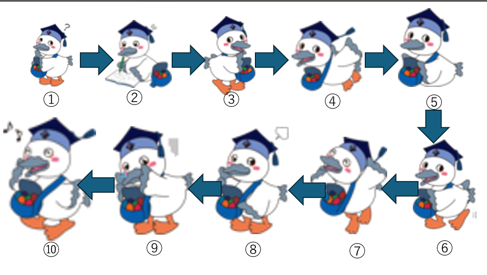

# 合体こうかとん

* こうかとん大きさ順

## 実行環境の必要条件
* python >= 3.10
* pygame >= 2.1
* 必要なものがあれば追記してください（非推奨）

## ゲームの概要
* 様々な形のこうかとんを合体させて大きくさせるゲーム

## ゲームの遊び方
* A&Dキーでこうかとんを操作し，エンターキー押下によって下に落とす
* 箱から溢れたら，ゲームオーバーとなる

## ゲームの実装
### 共通基本機能
* 背景画像と箱とこうかとんの当たり判定。エンターキー押下でこうかとん落下

### 分担追加機能
* 初期位置移動と箱の判定:Aキーで左、Dキーで右に初期位置を移動できるようにした。箱とこうかとんとの当たり判定を作った。（森田陽希）
* ゲームオーバーとスタート画面(担当:田口) :ラインを1.5秒超えたらゲームオーバーという表示が出る。スタートの前にクリックを押してスタートする。
* こうかとんの合体(担当:一川):同じ画像のこうかとんが合体すると次のこうかとんの画像に切り替わる
* こうかとんのランダム化(担当：宮川)
1. 0~9番までのこうかとん画像を追加。
2. 0~9番までのこうかとんのサイズを順に変更。
3. 落ちてくるこうかとんは0~4番までに制限。
* 効果音とスコア 一番小さいこうかとんが合体するごとに、1点、5点、10,20,30,40,50,60,100点,1000点と増えていく　(豊田和樹)

